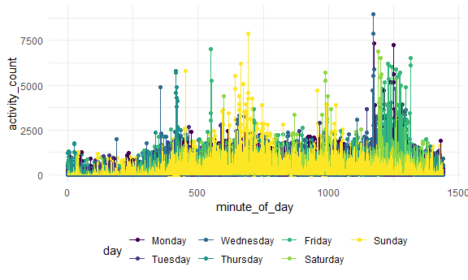

Homework 3 Solutions
================
Kailey Rishovd
10/10/2020

## Problem 1

``` r
data("instacart")

instacart
```

    ## # A tibble: 1,384,617 x 15
    ##    order_id product_id add_to_cart_ord~ reordered user_id eval_set order_number
    ##       <int>      <int>            <int>     <int>   <int> <chr>           <int>
    ##  1        1      49302                1         1  112108 train               4
    ##  2        1      11109                2         1  112108 train               4
    ##  3        1      10246                3         0  112108 train               4
    ##  4        1      49683                4         0  112108 train               4
    ##  5        1      43633                5         1  112108 train               4
    ##  6        1      13176                6         0  112108 train               4
    ##  7        1      47209                7         0  112108 train               4
    ##  8        1      22035                8         1  112108 train               4
    ##  9       36      39612                1         0   79431 train              23
    ## 10       36      19660                2         1   79431 train              23
    ## # ... with 1,384,607 more rows, and 8 more variables: order_dow <int>,
    ## #   order_hour_of_day <int>, days_since_prior_order <int>, product_name <chr>,
    ## #   aisle_id <int>, department_id <int>, aisle <chr>, department <chr>

This dataset contains 1384617 rows and 15 columns.

The dataset is extensive, providing details on the online grocery
service. Observations are the level of items in an order by user. There
are user / order variables – user ID, order ID, order day, order hour,
and reordered. There are also item variables – name, aisle, department,
and some numeric codes. Structurally, we can see that products are in
aisles, aisles are in departments, and the tracker supplies information
about each user, the products they buy, and where those products are
found around local stores. Users are also tracked for how often they
make orders, what they order and reorder, the order in which they shop,
and when they shop. In this dataset, we are given the information for
over 3 million orders from over 200k users.

#### A little more context…

**How many aisles are there, and which are most items from?**

``` r
instacart %>% 
  count(aisle) %>% 
  arrange(desc(n))
```

    ## # A tibble: 134 x 2
    ##    aisle                              n
    ##    <chr>                          <int>
    ##  1 fresh vegetables              150609
    ##  2 fresh fruits                  150473
    ##  3 packaged vegetables fruits     78493
    ##  4 yogurt                         55240
    ##  5 packaged cheese                41699
    ##  6 water seltzer sparkling water  36617
    ##  7 milk                           32644
    ##  8 chips pretzels                 31269
    ##  9 soy lactosefree                26240
    ## 10 bread                          23635
    ## # ... with 124 more rows

There are 134 aisles and most items are from the fresh vegetables aisle.

**Plot that shows the number of items ordered in each aisle…**

``` r
instacart %>% 
  count(aisle) %>% 
  filter(n > 10000) %>% 
  mutate(
    aisle = factor(aisle),
    aisle = fct_reorder(aisle, n)
  ) %>% 
  ggplot(aes(x = aisle, y = n)) + 
  geom_point() + 
  theme(axis.text.x = element_text(angle = 270, vjust = 0.5, hjust = 1))
```


From this plot we can see how many items were ordered in each aisle…
arranged by aisle with the least to the most items ordered. We can tell
things such as, butter is ordered the least and fresh vegetables and
fruits are ordered significantly more than other items.

**Table showing three most popular items in specified aisles… and how
many times they have been ordered…**

``` r
instacart %>% 
  filter(aisle %in% c("baking ingredients", "dog food care", "packaged vegetables fruits")) %>% 
  group_by(aisle) %>% 
  count(product_name) %>% 
  mutate(
    rank = min_rank(desc(n))
  ) %>% 
  filter(rank < 4) %>% 
  arrange(aisle, rank) %>% 
  knitr::kable()
```

| aisle                      | product\_name                                 |    n | rank |
| :------------------------- | :-------------------------------------------- | ---: | ---: |
| baking ingredients         | Light Brown Sugar                             |  499 |    1 |
| baking ingredients         | Pure Baking Soda                              |  387 |    2 |
| baking ingredients         | Cane Sugar                                    |  336 |    3 |
| dog food care              | Snack Sticks Chicken & Rice Recipe Dog Treats |   30 |    1 |
| dog food care              | Organix Chicken & Brown Rice Recipe           |   28 |    2 |
| dog food care              | Small Dog Biscuits                            |   26 |    3 |
| packaged vegetables fruits | Organic Baby Spinach                          | 9784 |    1 |
| packaged vegetables fruits | Organic Raspberries                           | 5546 |    2 |
| packaged vegetables fruits | Organic Blueberries                           | 4966 |    3 |

From this table, we can see the 3 most popular items ordered from the
“baking ingredients”, “dog food care” and “packaged vegetables fruits”
aisles - including how many times they have been ordered. The top
ranking items in each aisle are LIght Brown Sugar, Snack Sticks Chicken
and Rice Recipe Dog Treats, and Organic Baby Spinach, respectively.

**Table showing the mean hour of the day at which specified items are
ordered on each day of the week…**

``` r
instacart %>% 
  filter(product_name %in% c("Pink Lady Apples", "Coffee Ice Cream")) %>%
  group_by(product_name, order_dow) %>% 
  summarize(mean_hour = mean(order_hour_of_day)) %>% 
  pivot_wider(
    names_from = order_dow, 
    values_from = mean_hour
  ) %>% 
  knitr::kable()
```

    ## `summarise()` regrouping output by 'product_name' (override with `.groups` argument)

| product\_name    |        0 |        1 |        2 |        3 |        4 |        5 |        6 |
| :--------------- | -------: | -------: | -------: | -------: | -------: | -------: | -------: |
| Coffee Ice Cream | 13.77419 | 14.31579 | 15.38095 | 15.31818 | 15.21739 | 12.26316 | 13.83333 |
| Pink Lady Apples | 13.44118 | 11.36000 | 11.70213 | 14.25000 | 11.55172 | 12.78431 | 11.93750 |

In this table, we see the mean hour of the day, per day of the week,
that Pink Lady Apples and Coffee Ice Cream are ordered. Coffee Ice Cream
is mainly ordered between hour 12 and 16. Pink Lady Apples are ordered
around hours 11 and 15.

## Problem 2

Load and tidy the data…

``` r
accel_df = read_csv("./data/accel_data.csv")
```

    ## Parsed with column specification:
    ## cols(
    ##   .default = col_double(),
    ##   day = col_character()
    ## )

    ## See spec(...) for full column specifications.

``` r
accel_df = 
  accel_df %>%
    pivot_longer(
      activity.1:activity.1440, 
      names_to = "minute_of_day",
      values_to = "activity_count", 
      names_prefix = "activity."
    ) %>%
    mutate(
      Wkend_vs_Wkday = case_when(
        day == "Monday" ~ "Weekday",
        day == "Tuesday" ~ "Weekday",
        day == "Wednesday" ~ "Weekday", 
        day == "Thursday" ~ "Weekday", 
        day == "Friday" ~ "Weekday", 
        day == "Saturday" ~ "Weekend", 
        day == "Sunday" ~ "Weekend",
      )) %>% 
    mutate(
      day = as.factor(day), 
      minute_of_day = as.double(minute_of_day), 
      Wkend_vs_Wkday = as.factor(Wkend_vs_Wkday),
      )
```

After tidying up the data, we are left with a dataset that has 50400
rows and 6 columns. It consists of the information for five weeks of
accelerometer data for a 63-year-old male with BMI 25 and congestive
heart failure. The dataset has variables for each week, day of the week,
minute of the day, and activity count at each minute of the day… with
additional grouping information like weekend vs. weekday.

Now we can find total activity for each day and look for trends…

``` r
accel_df %>% 
  mutate(
    day = forcats::fct_relevel(day, "Monday", "Tuesday", "Wednesday", "Thursday", "Friday", "Saturday", "Sunday")
  ) %>% 
  group_by(day, week) %>% 
  summarize(total_day_activity = sum(activity_count)) %>%
  pivot_wider(
    names_from = day,
    values_from = total_day_activity,
  ) %>% 
  knitr::kable()
```

    ## `summarise()` regrouping output by 'day' (override with `.groups` argument)

| week |    Monday |  Tuesday | Wednesday | Thursday |   Friday | Saturday | Sunday |
| ---: | --------: | -------: | --------: | -------: | -------: | -------: | -----: |
|    1 |  78828.07 | 307094.2 |    340115 | 355923.6 | 480542.6 |   376254 | 631105 |
|    2 | 295431.00 | 423245.0 |    440962 | 474048.0 | 568839.0 |   607175 | 422018 |
|    3 | 685910.00 | 381507.0 |    468869 | 371230.0 | 467420.0 |   382928 | 467052 |
|    4 | 409450.00 | 319568.0 |    434460 | 340291.0 | 154049.0 |     1440 | 260617 |
|    5 | 389080.00 | 367824.0 |    445366 | 549658.0 | 620860.0 |     1440 | 138421 |

From the table, we can see a few trends. A few: most activity occurs in
the weekdays (Monday-Friday), high weekend activity dropped off after
week 3, the two lowest activity days were on the last two Saturdays of
observation, weeks two and three have the highest and most consistent
activity, and activity counts are most consistently the same on
Wednesdays.

We can also make a plot…

``` r
accel_df %>% 
    mutate(
    day = forcats::fct_relevel(day, "Monday", "Tuesday", "Wednesday", "Thursday", "Friday", "Saturday", "Sunday")
  ) %>% 
  ggplot(aes(x = minute_of_day, y = activity_count, color = day)) +
  geom_point() +
  geom_line()
```



From the plot, we can see other trends. For example, there is low
activity in the beginning of the day and the end of the day (likely due
to sleep), there is higher activity in the morning/early afternoon or
later in the evening (with a typical drop in the middle of the day), and
even more specifically, Sunday activity is generally in the early
afternoon and Friday activity is usually later in the evening.

## Probelm 3

First, load NY NOAA data…

``` r
data("ny_noaa")

ny_noaa
```

    ## # A tibble: 2,595,176 x 7
    ##    id          date        prcp  snow  snwd tmax  tmin 
    ##    <chr>       <date>     <int> <int> <int> <chr> <chr>
    ##  1 US1NYAB0001 2007-11-01    NA    NA    NA <NA>  <NA> 
    ##  2 US1NYAB0001 2007-11-02    NA    NA    NA <NA>  <NA> 
    ##  3 US1NYAB0001 2007-11-03    NA    NA    NA <NA>  <NA> 
    ##  4 US1NYAB0001 2007-11-04    NA    NA    NA <NA>  <NA> 
    ##  5 US1NYAB0001 2007-11-05    NA    NA    NA <NA>  <NA> 
    ##  6 US1NYAB0001 2007-11-06    NA    NA    NA <NA>  <NA> 
    ##  7 US1NYAB0001 2007-11-07    NA    NA    NA <NA>  <NA> 
    ##  8 US1NYAB0001 2007-11-08    NA    NA    NA <NA>  <NA> 
    ##  9 US1NYAB0001 2007-11-09    NA    NA    NA <NA>  <NA> 
    ## 10 US1NYAB0001 2007-11-10    NA    NA    NA <NA>  <NA> 
    ## # ... with 2,595,166 more rows

The NY NOAA dataset is from the NOAA National Climatic Data Center. In
the dataset there are 2595176 rows and 7 columns. It is meant to provide
the public with weather data such as the Global Historical Climatology
Network-Daily of weather stations in 180 countries. Variables include
the station id, date of record, minimum and maximum temperatures, daily
total precipitation, and snowfall and depth. However, the dataset is
full of missing values because of stations not reporting or reporting
partially… data descriptions report that about half of the stations only
report precipitation.

**Some more context…**

Let’s clean the data a bit…

``` r
ny_noaa = 
  ny_noaa %>% 
  separate(date, into = c("year", "month", "day"), sep = "-") %>% 
  mutate_at(vars(year:day), as.factor) %>% 
  mutate_at(vars(snow:tmin), as.double) %>% 
  mutate(
    prcp = prcp/10, 
    tmax = tmax/10, 
    tmin = tmin/10,
  )

skimr::skim(ny_noaa)
```

|                                                  |          |
| :----------------------------------------------- | :------- |
| Name                                             | ny\_noaa |
| Number of rows                                   | 2595176  |
| Number of columns                                | 9        |
| \_\_\_\_\_\_\_\_\_\_\_\_\_\_\_\_\_\_\_\_\_\_\_   |          |
| Column type frequency:                           |          |
| character                                        | 1        |
| factor                                           | 3        |
| numeric                                          | 5        |
| \_\_\_\_\_\_\_\_\_\_\_\_\_\_\_\_\_\_\_\_\_\_\_\_ |          |
| Group variables                                  | None     |

Data summary

**Variable type: character**

| skim\_variable | n\_missing | complete\_rate | min | max | empty | n\_unique | whitespace |
| :------------- | ---------: | -------------: | --: | --: | ----: | --------: | ---------: |
| id             |          0 |              1 |  11 |  11 |     0 |       747 |          0 |

**Variable type: factor**

| skim\_variable | n\_missing | complete\_rate | ordered | n\_unique | top\_counts                                       |
| :------------- | ---------: | -------------: | :------ | --------: | :------------------------------------------------ |
| year           |          0 |              1 | FALSE   |        30 | 201: 159671, 200: 148721, 200: 122665, 200: 93249 |
| month          |          0 |              1 | FALSE   |        12 | 10: 224471, 12: 223603, 07: 220348, 08: 220100    |
| day            |          0 |              1 | FALSE   |        31 | 01: 85258, 02: 85258, 03: 85258, 04: 85258        |

**Variable type: numeric**

| skim\_variable | n\_missing | complete\_rate |  mean |     sd |     p0 |   p25 |  p50 |  p75 |  p100 | hist  |
| :------------- | ---------: | -------------: | ----: | -----: | -----: | ----: | ---: | ---: | ----: | :---- |
| prcp           |     145838 |           0.94 |  2.98 |   7.82 |    0.0 |   0.0 |  0.0 |  2.3 |  2286 | ▇▁▁▁▁ |
| snow           |     381221 |           0.85 |  4.99 |  27.22 | \-13.0 |   0.0 |  0.0 |  0.0 | 10160 | ▇▁▁▁▁ |
| snwd           |     591786 |           0.77 | 37.31 | 113.54 |    0.0 |   0.0 |  0.0 |  0.0 |  9195 | ▇▁▁▁▁ |
| tmax           |    1134358 |           0.56 | 13.98 |  11.14 | \-38.9 |   5.0 | 15.0 | 23.3 |    60 | ▁▂▇▆▁ |
| tmin           |    1134420 |           0.56 |  3.03 |  10.40 | \-59.4 | \-3.9 |  3.3 | 11.1 |    60 | ▁▁▇▂▁ |

And then let’s look at the snowfall variable…

``` r
ny_noaa %>% 
  count(snow) %>% 
  arrange(desc(n))
```

    ## # A tibble: 282 x 2
    ##     snow       n
    ##    <dbl>   <int>
    ##  1     0 2008508
    ##  2    NA  381221
    ##  3    25   31022
    ##  4    13   23095
    ##  5    51   18274
    ##  6    76   10173
    ##  7     8    9962
    ##  8     5    9748
    ##  9    38    9197
    ## 10     3    8790
    ## # ... with 272 more rows

The most commonly observed values in order from 1-3 are: 0mm, NA, and
25mm. This is likely due to places with little snowfall reporting the
most and many stations not reporting at all.

Now… let’s make a plot…

``` r
ny_noaa %>% 
    filter(
    month %in% c("01", "07")
    ) %>% 
    group_by(month, year, id) %>% 
  summarize(
    mean_tmax = mean(tmax, na.rm = TRUE)
  ) %>% 
  ggplot(aes(x = year, y = mean_tmax, group = id, color = id)) +
  geom_point() + 
  geom_line() +
  facet_grid(. ~ month) +
  theme(legend.position = "none") +
  theme(axis.text.x = element_text(angle = 270, vjust = 0.5, hjust = 1)) +
  labs(
    title = "Average max temperature Jan/July 1981-2010, across stations", 
    x = "Year", 
    y = "Avgerage max temp (C)", 
    caption = "Data from ny noaa package"
  )
```

    ## `summarise()` regrouping output by 'month', 'year' (override with `.groups` argument)

    ## Warning: Removed 5970 rows containing missing values (geom_point).

    ## Warning: Removed 5640 row(s) containing missing values (geom_path).


